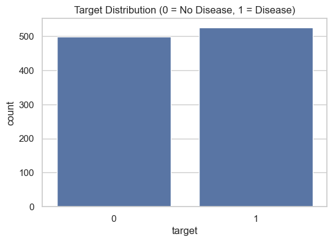
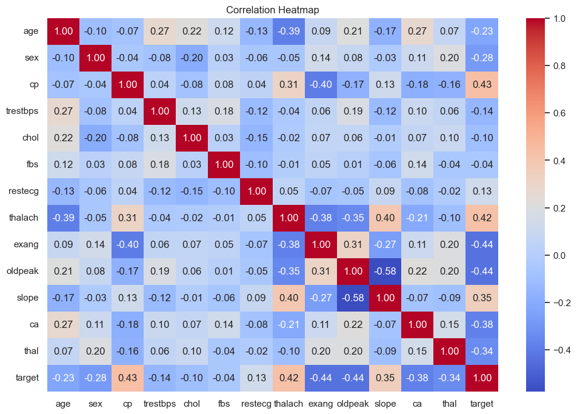
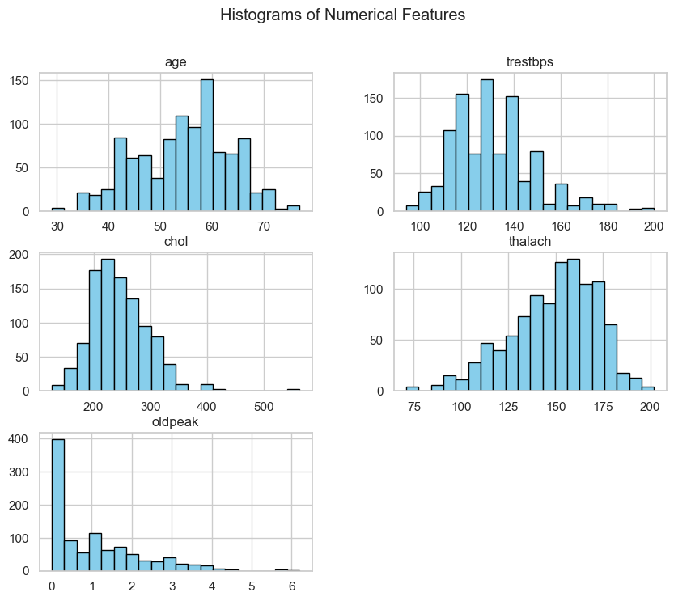
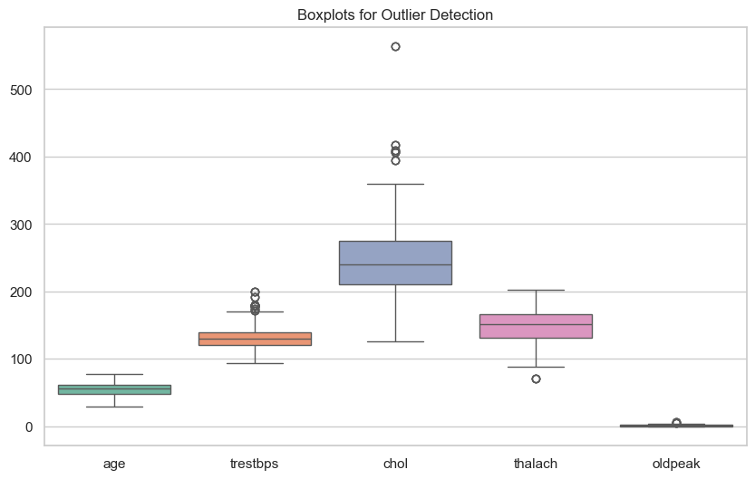
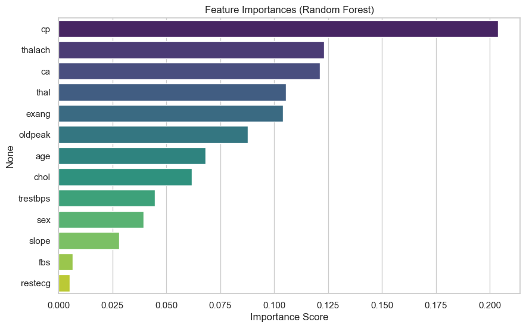
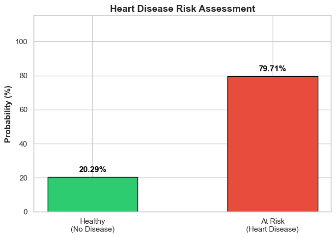

# 🫀 Heart Disease Prediction System

Welcome to the **Heart Disease Prediction System**! This repository contains a complete end-to-end Machine Learning pipeline that predicts the likelihood of a patient having heart disease based on their clinical test results. 

---

## 🚀 1. What Actually I'm Doing
I am building an automated, command-line-based predictive diagnostic system. By taking in various physiological and clinical parameters of a patient (such as age, blood pressure, cholesterol, and heart rate), this system processes the data and predicts whether the patient is at a **High Risk** or **Low Risk** of having heart disease.

## 🛠️ 2. How I'm Doing It
This project is implemented using **Python** and standard data science libraries (`pandas`, `scikit-learn`, `joblib`). 
- **Data Preprocessing:** The data is cleaned (dropping duplicates) and numerical features are standardized using `StandardScaler`.
- **Modeling:** I use a Machine Learning classification algorithm. Hyperparameter tuning is applied to find the absolute best model parameters.
- **Workflow:** The project is split into two straightforward scripts:
  - `train.py`: For training the model and saving the serialized artifacts.
  - `predict.py`: An interactive script for feeding new patient data and receiving an instant diagnostic report.

## 💡 3. Why I'm Doing It
Heart disease is one of the leading causes of mortality globally. Early detection is crucial for effective treatment and survival. I am building this project to:
- Provide an **accessible and fast preliminary diagnostic tool**.
- Assist healthcare professionals by offering data-driven insights.
- Demonstrate how Machine Learning can be practically applied to real-world healthcare problems.

---

## 📊 4. About the Dataset
The dataset contains clinical and non-invasive test results of various patients.
- **Download Source:** [UCI Machine Learning Repository - Heart Disease Dataset](https://archive.ics.uci.edu/dataset/45/heart+disease)
- **Number of Rows (Instances):** 1025
- **Number of Columns:** 14 (13 features + 1 target variable)

### Features Include:
1. `age`: Age in years
2. `sex`: Sex (1 = male; 0 = female)
3. `cp`: Chest pain type (0-3)
4. `trestbps`: Resting blood pressure (in mm Hg)
5. `chol`: Serum cholesterol in mg/dl
6. `fbs`: Fasting blood sugar > 120 mg/dl (1 = true; 0 = false)
7. `restecg`: Resting electrocardiographic results (0-2)
8. `thalach`: Maximum heart rate achieved
9. `exang`: Exercise-induced angina (1 = yes; 0 = no)
10. `oldpeak`: ST depression induced by exercise relative to rest
11. `slope`: The slope of the peak exercise ST segment (0-2)
12. `ca`: Number of major vessels (0-4) colored by fluoroscopy
13. `thal`: Thalassemia (0-3)
14. `target`: Presence of heart disease (1 = Disease, 0 = No Disease)



---

## 📈 5. Exploratory Data Analysis (EDA)

Understanding the data is key. In our Jupyter Notebook (`Heart_Disease.ipynb`), various visualizations were created to understand feature relationships:

### 🔹 Correlation Heatmap
The heatmap shows how strongly each feature correlates with the target. Features like `cp` (chest pain), `thalach` (max heart rate), and `slope` show positive correlations, while `exang` and `oldpeak` show strong negative correlations.
>

### 🔹 Histograms & Data Distribution
Histograms help us understand the age distribution, blood pressure spread, and cholesterol levels of our patient data. 


### 🔹 Boxplots (Outlier Detection)
Boxplots were utilized to visualize continuous variables (`trestbps`, `chol`, `thalach`) and identify potential outliers before scaling the data.


### 🔹 Feature Importances
This visualizes which clinical tests are the most critical in determining heart disease presence. 


### 🔹 Diagnostic Prediction Report 
The terminal application generates a highly readable and intuitive Diagnostic Report detailing the calculated probabilities for the patient.

---

## 🧠 6. Which Model I Used and Why

**Model Chosen:** `Support Vector Machine (SVM)`

**Why SVM?**
1. **High Dimensionality & Tabular Data:** SVMs perform exceptionally well on structured, tabular data where boundaries between classes (disease vs. no disease) are relatively distinct.
2. **Robustness to Overfitting:** By optimizing the `C` (regularization) parameter, SVM avoids overfitting, especially on moderately sized datasets like ours.
3. **Flexibility via Kernels:** Using `GridSearchCV`, the pipeline automatically tests both `linear` and `rbf` (Radial Basis Function) kernels to find the most accurate non-linear hyperplanes separating the data.
4. **Probabilistic Outputs:** I configured the SVM to output probability percentages (`probability=True`), allowing us to provide detailed confidence metrics in the prediction report rather than just a simple Yes/No.

---

## 💻 7. How to Train and Predict (Quickstart)

Ensure you have a virtual environment set up and the required dependencies installed (`pandas`, `scikit-learn`, `joblib`).

### Step 1: Train the Model
Run the training script to load the data, scale features, tune the SVM, and save the final models to the `models/` directory.
```bash
python train.py
```
**What happens?**
- Drops duplicate records to prevent data leakage.
- Scales continuous variables (`age`, `trestbps`, `chol`, etc.).
- Performs cross-validation grid search to find the absolute best SVM.
- Saves `scaler.joblib` and `svm_model.joblib`.

### Step 2: Make Predictions
Run the interactive prediction script to enter a patient's clinical data and get a diagnosis.
```bash
python predict.py
```
**What happens?**
- You will be prompted to enter values for all 13 clinical features.
- The script automatically scales the input based on the saved `scaler`.
- Evaluates the patient against the `SVM model`.
- Prints a structured **Diagnostic Prediction Report** with exact probabilities.
